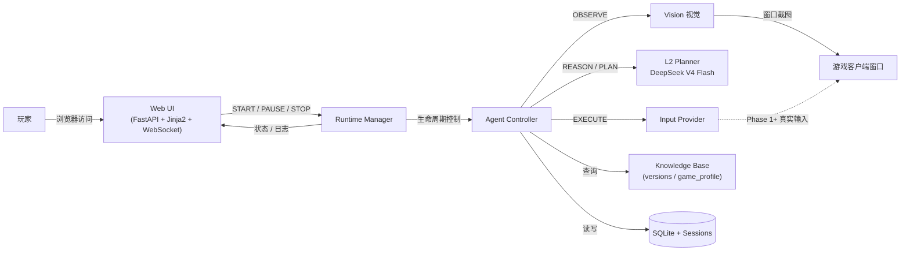
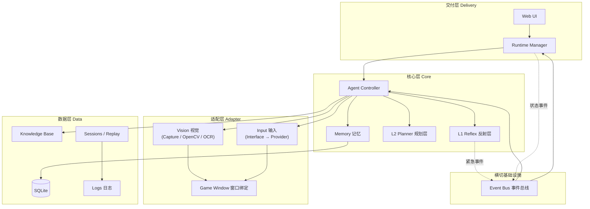
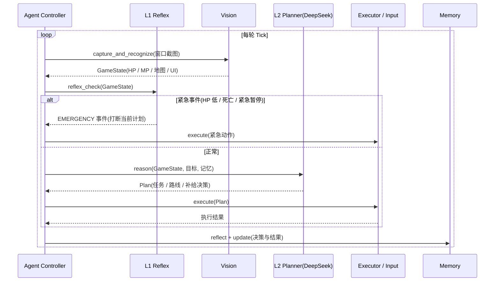
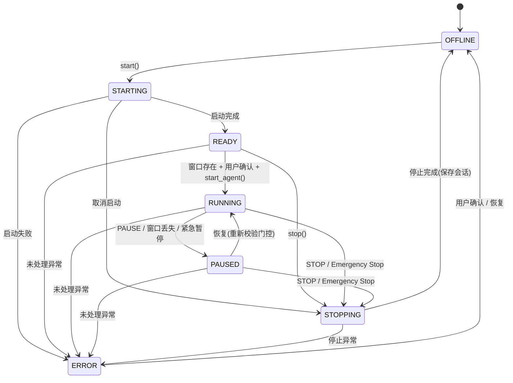
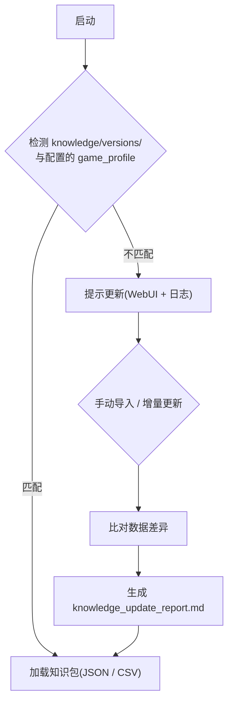
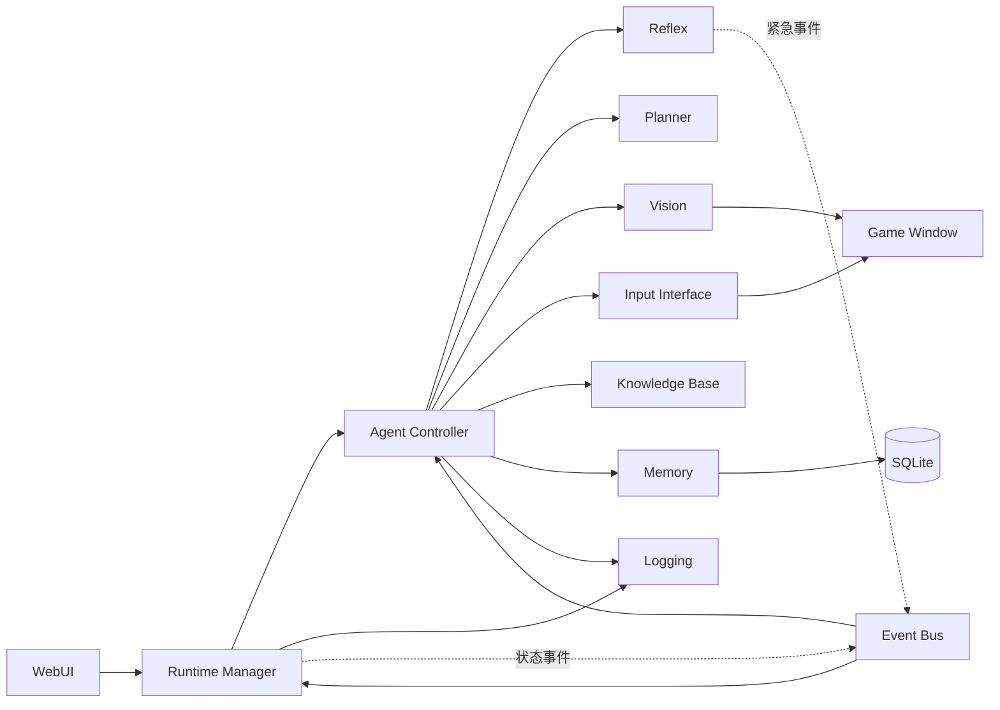

# Maple AI Companion Agent — 架构图

> 全部为 Mermaid 源码,可直接在 GitHub、Typora 或支持 Mermaid 的编辑器中渲染。

## 1. 系统上下文

## 2. 分层架构(容器图)

## 3. Agent Loop 时序

## 4. Runtime 状态机

## 5. 知识库版本与更新流程

## 6. 模块依赖图

## 7. 图例说明

- 实线:正式调用/数据流;
- 虚线(`-.->`):事件/异步通知(Reflex 紧急事件、Runtime 状态事件等,经 Event Bus 路由);
- 各模块职责与依赖表详见 [01-system-design.md](01-system-design.md)。
